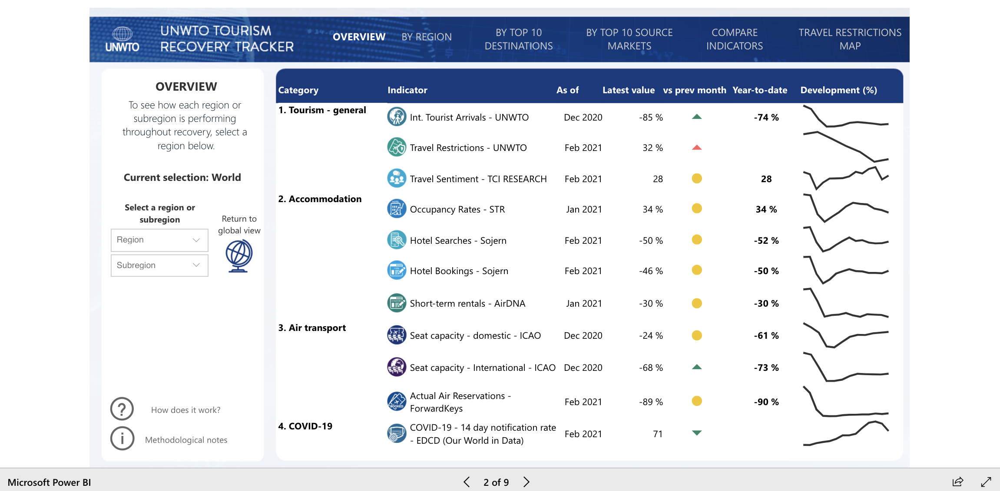
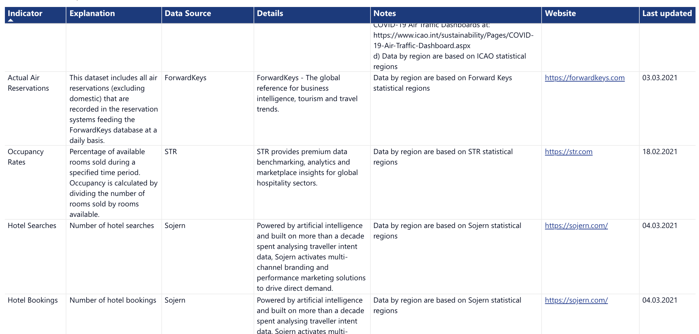
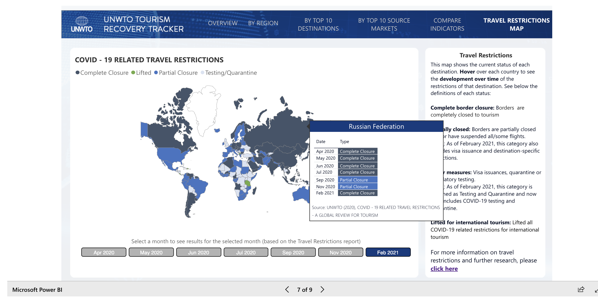

# The Flight To Recovery:Exploring Safety Measures Between Tourism and COVID-19
## Nicole Lorenzo | GEOG 458 | Final Essay

### Introduction
Since the beginning of quarantine in March 2020, COVID-19 has tested the limits of socioeconomic and environmental challenges throughout communities worldwide. Health resources and policies have been evaluated since then to help communities get through this tough time. Travel being a significant factor to possible exposure to COVID-19 has resulted in many governments putting travel restrictions in place and encouraging most citizens to do their due diligence and not travel [(The Washington Post)](https://www.washingtonpost.com/lifestyle/travel/what-covid-19-did-to-travel--and-what-it-will-do/2021/03/10/3730719e-80de-11eb-81db-b02f0398f49a_story.html). For many destinations, the communities thrive off of the tourist industry. COVID-19 hasn’t only taken a toll on the health of individuals, but also the economic backbone of many communities. The tourism industry includes entertainment, travel, hotels and vacation stays. With the shutdown of many industries and COVID regulations, the travel industry has been suffering with less tourists and not being able to function at full capacity.

Moving forward, it’s important that with COVID-19, communities and governments start to prioritize prevention and safety. As more destinations start to open their borders, it’s important to acknowledge tourism recovery, especially in terms of boosting economies. Travel restrictions are beginning to ease, it’s important to manage travel patterns so businesses and governments can act accordingly. Keeping track of this data is essential to moving forward with future travel restrictions and ensuring the safety of local and incoming tourists.

### The Data
#### <ins>Overview and Purpose</ins>
The interactive data dashboard that will be discussed in this report is provided by The World Tourism Organization (UNWTO) and is titled the [“Tourism Recovery Tacker”](https://www.unwto.org/unwto-tourism-recovery-tracker) (World Tourism Organization). Conveniently in one space, the Tourism Recovery Tracker displays recovery (if any) trends on a monthly basis on global and regional scale, including a section explaining the top ten destinations.Major functions of the tracker include being able to compare regions and top destinations based on the indicators listed below. Understanding that tourism is essential to a lot of destinations, it becomes a challenge of changing protocols and also ensuring the safety of the local population.
The purpose and goal of this tracker is to provide governments and private businesses a resource to track travel patterns and foreshadow potential travel, to prepare for precautions and restrictions.

Below: Picture of the dashboard overview. Note the data summary and indicators

#### <ins>Important Indicators and Contributors</ins>
Being able to view the data globally, regionally, and sunregionally, these are the four categories when assessing tourism recovery (listed below with the data providers):

1. Tourism - General
* International Tourist Arrivals (UNWTO data)
* Travel Restrictions (UNWTO data)
* Travel Sentiment (TCI Research)
2. Accommodation
* Occupancy Rates (STR)
* Hotel Searches (Sojern)
* Hotel Bookings (Sojern)
* Short-term rentals (AirDNA)
3. Air transport
*Seat Capacity - Domestic (ICAO)
*  Seat Capacity - International (ICAO)
* Actual Air Reservations (ForwardKeys)
4. COVID-19
* 14 day notification rate (EDCD)

Below: Screenshot from recovery tracker of contributors per each indicator
 

#### <ins>Planning</ins>
Looking at these indicators (above) on global and regional scales can give hindsight as to where different destinations are in terms of travel restrictions, especially with COVID-19 trends. On the provided “travel restrictions map” located on the tracker, the color blocked map provides monthly COVID-19 related travel restrictions per country per month. This provides a comparison as to how open or closed countries have been throughout quarantine.

### Data Architecture
The World Travel Organization is the creator of the Tourism Recovery Tracker. Along with other contributors, they post global COVID-19 related travel restrictions. On the data dashboard, recent update dates are available for each of the indicators provided. As mentioned on the website, this tracker is the “most comprehensive tourism dashboard to date”. This is a partnership between international organizations and private sectors. Partners include: International Civil Aviation Organisation (ICAO), ForwardKeys, STR, Sojern, TCI Research and AirDNA. The UNWTO states that data is updated monthly in real time. On the data source section of the tracker, an explanation of the indicators as well as their contributors are displayed, along with the date the last update was. Thinking about the system architecture of the data, it would be interesting to go back and store the different data that each contributor is bringing to the table. For instance, to get stats for hotel and accommodation searches, the data would be endless. In relation to the topic of geospatial data, it then becomes a task of understanding time, place, and search content. That being said, having a geospatial server means that there are file servers or database servers feeding information. The web server then creates the missing link from the geospatial server to the web client, the website that makes the data available to the public. Speaking more about the geospatial server, in relation to analyzing Tweets in real time, these contributors and UNWTO are getting data and uploading it on a monthly basis. The data dashboard itself is supported through Microsoft Power BI, a data manipulation and visualization tool. This collaboration happening in the backend is important to note that multiple databases are being shared. It would be interesting to look at whether this stage is happening on individual servers or collaborative cloud servers.

### Dashboard Evaluation: User Experience and Accessibility
Once on the UNWTO website and navigated to the Tourism Recovery Tracker, a separate box appears on the page that displays the data dashboard. The dashboard is powered by Microsoft Power BI, a visualization tool for data. There are a total of 9 slides that go through each of the data and explanation of the data sources. At the initial look of the project, it seems organized and throughout moving through the project, the indicators are viewed on different charts, graphs and scales. In mind, the main purpose of the dashboard is to interactively discover patterns and foreshadow travel. By displaying the indicators this way, it makes it easy to not only visualize data with other regions/subregions, but also areas with itself over time. The travel restrictions map also displays COVID-19 related travel restrictions for the current and past available months when you hover over a country. This comparison feature throughout the dashboard is supplemental or the overall goal.

As previously mentioned, there is no doubt that the dashboard is doing what it’s supposed to do. All of the information needed to track recovery is there. Now taking a look at how it is displayed will be more critical. Navigating to explore the indicators by region, top ten destination and top ten market source, there are charts that display numerical data for each region and indicator. Without having looked at the data resources and notes, there would be no way of understanding what the numbers represent. This may just be a labeling issue, but it shouldn;t be anything too tough to solve. Along with the COVID-19 related restrictions map, the data dashboard displays the majority of the data using histograms and line charts. I feel like this is a great and clean way to display data overtime. Overall, the data is accessible for free and provides external links to the contributors for more details about the data provided.

Below: Restictions map

### Pros and Cons
One of the biggest pros mentioned about the dashboard is that you can compare regions and subregions overtime with specific indicators. This also leads to the biggest con. There is an option to get an overview of overall trends throughout all indicators combined, but there is no option to do a side by side analysis on 2 or more indicators at a time. This would be most helpful when looking at how COVID related 14 day quarantine enforcements are affected by incoming travelers. It would also be interesting and useful to see how searches and booking actually relate side by side.

As a further recommendation for the restrictions map provided, it would also be helpful to provide further information that would supplement the restriction protocols per country. For example, incorporate other data such as COVID-19 trends overtime. The goal of this is to create an alternative interactive way to understand restrictions. The visualization could also go into depth about population to COVID rate and scale to popular cities. As the overall goal of the dashboard is to promote travel recovery, having this extended visual would hopefully make people more conscientious of travel decisions for the sake of the local population’s safety.

### Conclusion
Tying back to the idea of COVID-19 effects on the socioeconomic balance through different societies, this data dashboard does provide an outlook to healthcare and policy making. Especially as travel starts up again, this data is important to understanding the restrictions of different destinations and reflect on how COVID is affecting the local population. Looking at a destination’s restrictions overtime can also provide travelers with a moment of reflection on how much more impactful their vacation may be.

This data dashboard provides further insight to just one part of the COVID-19 outbreak and the potential healing to all the damage done so far. A key lesson that goes beyond this dashboard is that in order to recover as a whole, communities and people need the resources to rebuild. Yes, travel is essential to many economies, but the tourism industry can’t succeed without the local populations that make it happen. As both travelers and policy makers, this dashboard should create a sense of reconsideration before booking a flight or opening borders. Not all destinations have the resources to support its own people, let alone incoming tourists.
